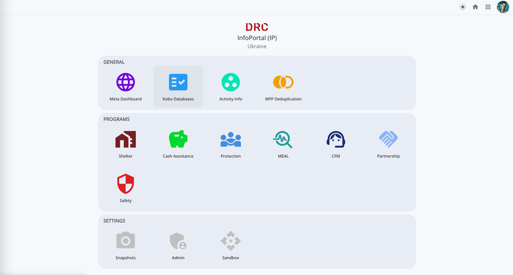
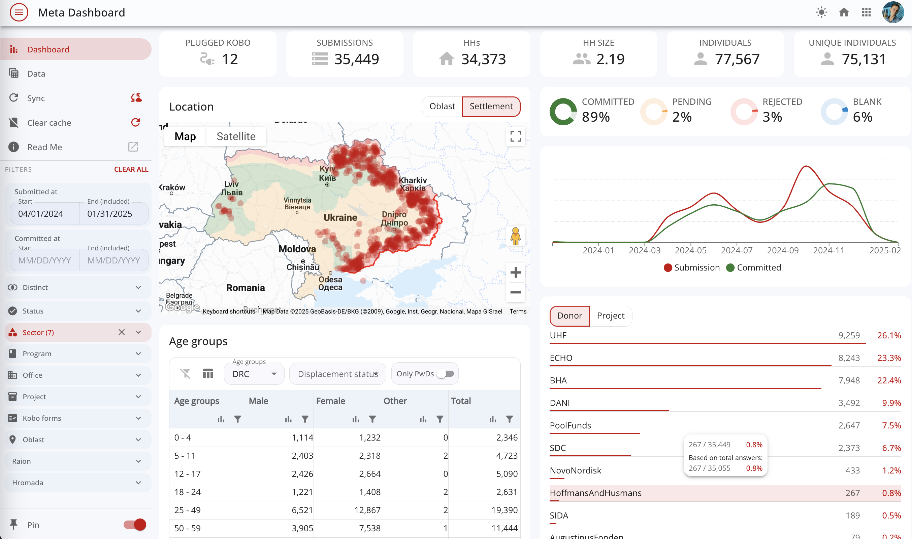
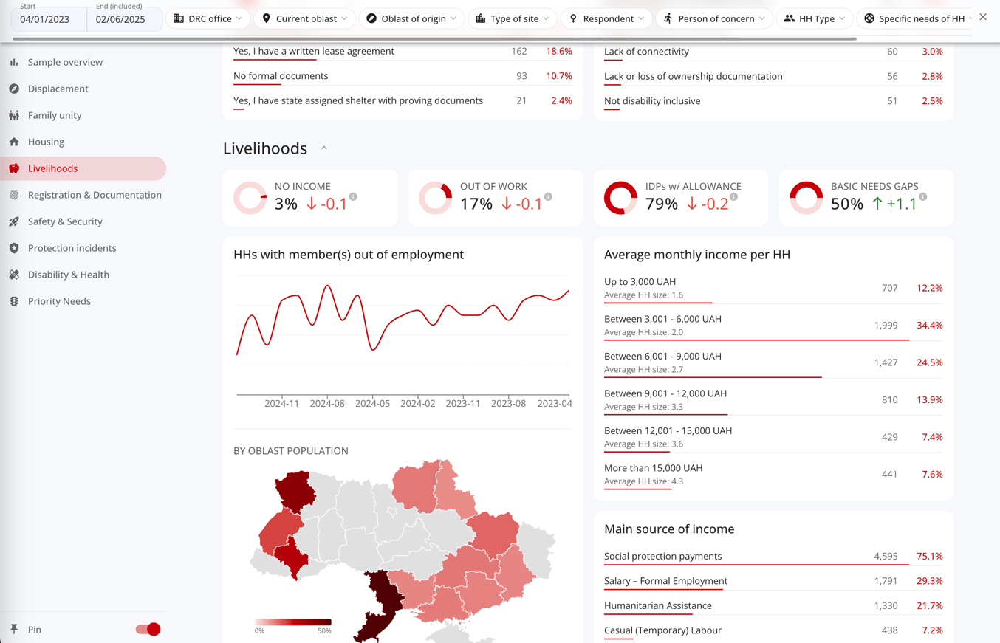
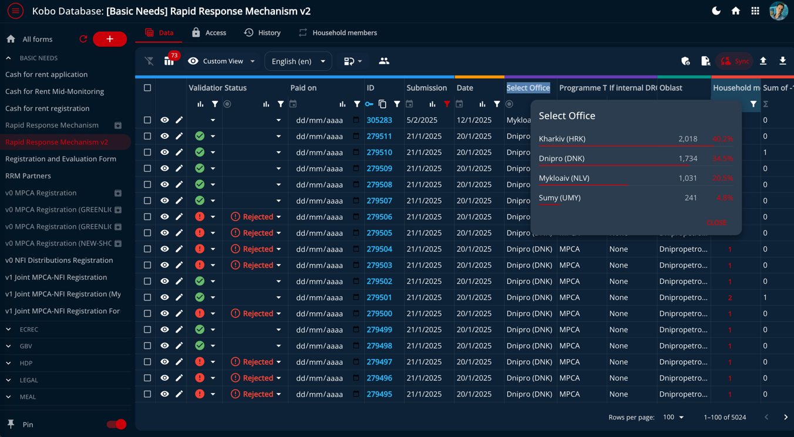
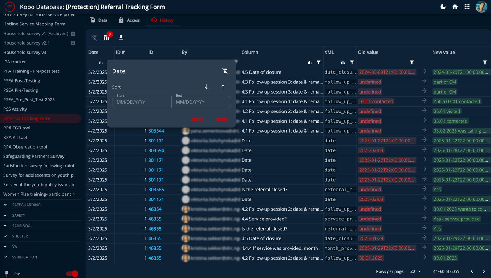
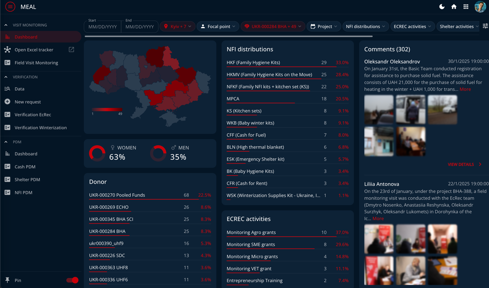

# InfoPortal

InfoPortal is an application developed for the Ukrainian humanitarian mission of DRC. It serves as a central hub for
Information Management, ensuring that all mission data is harmonized and properly managed with controlled access.

### 🔗 [https://infoportal-ua.drc.ngo/](https://infoportal-ua.drc.ngo/)

## External APIs Links

- [KoboToolbox](https://kobo.drc.ngo/#/projects/home). Large integration with advanced database features.
- [MS graph](https://developer.microsoft.com/en-us/graph/graph-explorer). For SSO and retrieve users information
- [ActivityInfo](https://www.activityinfo.org/). Cluster reporting database.
- [WFP BuildingBlocks](https://buildingblocks.ukr.wfp.org/home-basic). Cluster deduplication system.
- HDP MsSQL database.
- [Legal LAU App](https://lau.drc.in.ua/). No longer used but the client is still working.

## Application Management

### Azure

[portal.azure.com]([https://portal.azure.com/#@drcngo.onmicrosoft.com/resource/subscriptions/30070d2b-69df-431c-9f8f-68014ea7f128/resourceGroups/DRC-RG-IMAA-UKR/providers/Microsoft.Web/sites/drc-imaa-ukr-tools/appServices](https://portal.azure.com/))

### Email client

Using Sendgrip managed by DRC HQ.

### PaperTrail

[my.papertrailapp.com](https://my.papertrailapp.com/groups/39251744/events)

